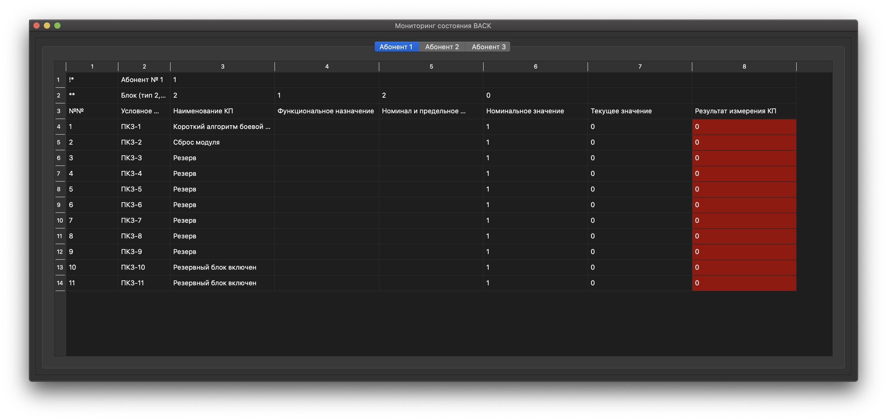

# Мониторинг состояния ВАСК

## Краткая информация

> Python v3.8.2

> Интерфейс на основе PyQt5

> Взаимодействие между ВАСК-Сервер-Клиент - socket

---
## Установка зависимостей
```
pip install -m requirements.txt
```
---
### Запуск эмулятора модуля ВАСК
```
python VASK/main.py
```

### Запуск сервера с GUI для мониторинга состояния
```
python server/main.py
```

### Запуск эмулятора клиента
```
python client/main.py
```
---
## Пример окна мониторинга состояния ВАСК

